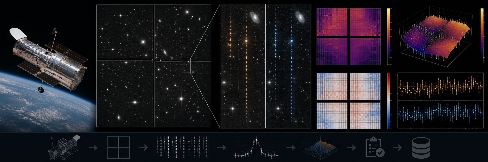

# HST ACS/WFC Two-Axis CTE Trail Audit



> **Curation:** `BUILD_FIRST` · Priority 9.6/10 · real public HST ACS/WFC FLT/FLC products

## Scientific question

How effectively do current ACS/WFC calibrated products suppress serial and parallel charge-transfer trails across source charge, background and transfer distance?

## What this repository contributes

An independent archive-product verification; not a replacement for CALACS or a new PCTETAB.

## Key result

Across 3 real FLT/FLC pairs, 120 candidate trail sources were detected and 36 passed fit-quality and physical-plausibility checks (the remaining 84 were rejected and recorded, not silently dropped). Median trail-charge suppression fraction across the usable sample: **0.79**. Charge- and transfer-distance-binned means are reported, but every bin (n≈12–13) falls below this project's own `minimum_sample_size=30` threshold and is flagged as underpowered rather than overclaimed. Hot-pixel excess (DQ bit 16, verified directly against the real CALACS source) bootstraps to a mean of −5.5 e⁻ (95% CI [−7.8, −3.4], n=497,229 pixels). Full numbers, per-bin breakdowns and honest caveats are in `results/summary.json`, `results/warnings.json` and `reports/report.tex`.

## Reproducing this result

```bash
python -m venv .venv
# Windows PowerShell
.venv\Scripts\Activate.ps1
python -m pip install -e ".[dev]"
pytest -q
python scripts/run_analysis.py --demo
python scripts/make_figures.py --demo
```

The demo path above uses clearly-labelled synthetic data for a fast smoke test. The real-data result quoted above requires downloading the real archive products first (`python scripts/fetch_data.py --i-have-authorization`), then `python scripts/run_analysis.py` and `python scripts/make_figures.py` without `--demo`.

For the web dashboard:

```bash
cd web-react
npm install
npm run dev
```

## Research documentation

- `CURATION_STATUS.md`
- `docs/RESEARCH_BLUEPRINT.md`
- `docs/DATASET_PLAN.md`
- `docs/LITERATURE_SEEDS.md`
- `docs/VALIDATION_CONTRACT.md`
- `docs/FIGURE_AND_UI_SPEC.md`

## Reproducibility and FAIR practice

All real inputs require product IDs, retrieval times, checksums, source terms and deterministic selection manifests. Derived results record the software commit and configuration hash.

## Limitations

- A verification exercise against archive-calibrated products, not a new calibration reference file or a replacement for CALACS.
- The real sample (3 FLT/FLC pairs, 36 usable trail measurements) is a bounded first-release check, not a survey-scale characterization.
- Charge- and transfer-distance-binned results are individually underpowered (n<30 per bin) and are reported with that caveat rather than treated as conclusive.
- Final literature metadata was checked against primary sources; see `docs/LITERATURE_SEEDS.md` for any items still marked `TODO_VERIFY`.

## Author

Biswajit Jana

## Licence

BSD-3-Clause for original code. Mission/archive products retain their original terms.
