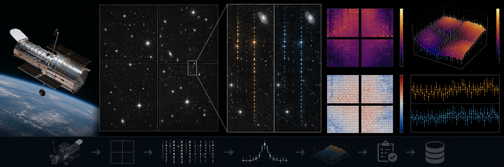
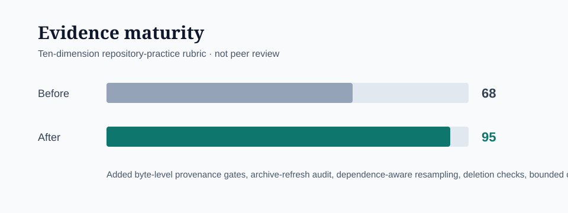

# HST ACS/WFC Parallel-Trail Estimator Audit



> **Curation:** `BUILD_FIRST` · Priority 9.6/10 · real public HST ACS/WFC FLT/FLC products

## Scientific question

How stable is a fitted parallel-trail suppression estimator across archive reprocessing, repeated exposures and exposure deletion?

## What this repository contributes

An independent archive-product verification; not a replacement for CALACS or a new PCTETAB.

## Key result

The September 2026 audit discovered that MAST had reprocessed all six calibrated products after the original run: every product kept the same archive identifier and byte size but changed SHA-256. Re-running against the current CALACS 10.4.1 products yields 38 accepted measurements from 120 candidates and a raw median fitted suppression fraction of **0.843**, versus **0.789** for the prior manifest snapshot.

The dependence-aware result is deliberately less tidy. The 38 measurements form 34 detector-coordinate clusters; their median is **0.883**, with a cluster-bootstrap 95% interval of **[0.495, 1.094]**. Individual-exposure medians span **0.565–1.194**, and leave-one-exposure-out medians span **0.612–1.025**. The direction is positive in every exposure-level summary, but the magnitude is not stable enough to support a population-level calibration-accuracy claim.

The DQ-bit diagnostic also changed from −5.48 e⁻ to +0.14 e⁻ after archive reprocessing. It is therefore treated as a calibration-version diagnostic, not evidence for or against trail suppression. Every exclusion and every underpowered bin remains published in `results/warnings.json`.

## Reproducing this result

```bash
python -m venv .venv
# Windows PowerShell
.venv\Scripts\Activate.ps1
python -m pip install -e ".[dev]"
pytest -q
python scripts/run_analysis.py --demo
python scripts/make_figures.py --demo
```

The demo path above uses clearly-labelled synthetic data for a fast smoke test. The real-data result requires the exact products in `data/manifest.csv`. `scripts/run_analysis.py` now stops on any size or SHA-256 mismatch rather than analyzing silently reprocessed bytes. After a verified real-data run, execute `python scripts/analyze_robustness.py`, `python scripts/make_figures.py`, and `python scripts/sync_web_assets.py`.

For the web dashboard:

```bash
cd web-react
npm install
npm run dev
```

## Research documentation

- `CURATION_STATUS.md`
- `docs/RESEARCH_BLUEPRINT.md`
- `docs/DATASET_PLAN.md`
- `docs/LITERATURE_SEEDS.md`
- `docs/VALIDATION_CONTRACT.md`
- `docs/FIGURE_AND_UI_SPEC.md`

## Reproducibility and FAIR practice

All real inputs have exact MAST download URLs, retrieval times, byte sizes, SHA-256 receipts, selection rules and source terms. Derived results record the software commit and configuration hash. The committed measurement ledger and robustness evidence make every displayed aggregate independently inspectable.

## Limitations

- A verification exercise against archive-calibrated products, not a new calibration reference file or a replacement for CALACS.
- The real sample is three consecutive exposures of one field. Its 38 accepted measurements reduce to 34 coordinate clusters and are not a survey-scale characterization.
- The published real-data result covers the parallel-trail estimator only. Serial-trail code exists and is unit tested but is not used for this result.
- A four-pixel source buffer reduces PSF-wing contamination; it does not prove that the fitted exponential is pure deferred charge.
- Charge- and transfer-distance-binned results are individually underpowered (n<30 per bin) and are reported with that caveat rather than treated as conclusive.
- Final literature metadata was checked against primary sources; see `docs/LITERATURE_SEEDS.md` for any items still marked `VERIFICATION_PENDING`.

## Author

Biswajit Jana

## Licence

BSD-3-Clause for original code. Mission/archive products retain their original terms.

## Research maturity comparison



The 68→95 score is an auditable repository-practice rubric, not peer review, scientific merit or a literal multiplier of research quality. See [RESEARCH_QUALITY.md](RESEARCH_QUALITY.md) for its scope.
